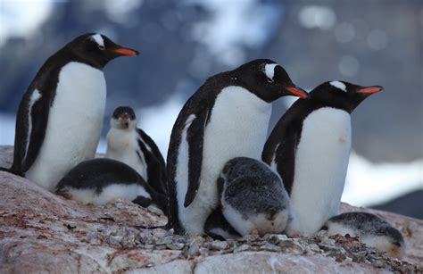

| Adelie penguins                     | Chinstrap penguins                  | Gentoo penguins                     |
| ----------------------------------- | ----------------------------------- | ----------------------------------- |
| |            |     


# Penguin Analysis

*Purpose*\
To perform a statistical analysis on three sets of penguin data, build linear regression models in order to predict penguin future expectations (body mass) for sustainability requirements, specifically feeding, and build a K-means partitioning model to provide insights into the underlying structure within the dataset and confirm if a clustering by sex and species is most expedient  

*Deliverables*\
This project has three components:    
* **Notebook Part I** contains an extensive EDA: cleaning of the data set, statistical analyses, and visualizations of the penguin data set. The statistical analyses include examinations into the penguins by both species and sex.
  
* **Notebook Part II** attempts to ascertain if there are certain penguin features that can help predict a penguin’s body mass using regression models. Regression models are a group of statistical techniques that use existing data to estimate the relationships between a single dependent variable and one or more independent variables. 

To answer these questions Part II contains: 
   * a. simple linear regression model for which the feature `body_mass_g` is assigned as the continuous dependent variable y (the variable a given model estimates) and `bill_length_mm` as the independent variable X (the explanatory variable or predictor variable). A simple linear regression is appropriate here, because it is a technique that estimates the linear relationship between one independent variable X and one continuous dependent variable y.
   * b. a multiple linear regression model once again assigning the feature `body_mass_g` as the continuous dependent variable, but rather than 1 independent X variable, several all are assessed and several selected. A multiple linear regression is appropriate here, because it estimates the linear relationship between a continuous dependent variable y and one or more independent variables X.

      
* **Notebook Part III** contains a K-means clustering model built to identify patterns in the penguin data. These patterns will confirm if there is a standard set of measurements specific to each species. K-means clustering is an unsupervised partitioning algorithm which clusters unlabeled data. It does this by creating a logical scheme to make sense of that data. K-means works by defining each cluster around a central point (centroid) that is determined by the mean of all points in the cluster. K-means can find patterns not already recognized or confirm those which have been. The identified patterns will confirm the body mass predictions made by the regression models providing further security that they are reliant. Reliant body mass predications mean proper care taking of the penguins can take place with confidence.

*Data*\
This project uses the Palmer Penguins data set collected and made available by Dr. Kristen Gorman and PalmerStation, Antarctica, LTER. The data is available at: https://allisonhorst.github.io/palmerpenguins. Here it was accessed through the seaborn library. 

The penguins included are from the Antarctica islands close to Terra del Fuego known as the Biscoe Islands. 

*Code*\
All code for this project is located at: https://github.com/izsolnay/Penguins_Python

*Report*\
The report for this project is located at: https://github.com/izsolnay/Penguins_Python


```python
from IPython.display import IFrame
IFrame(src='Biscoe_islands_map.html', width=600, height=600)
```


